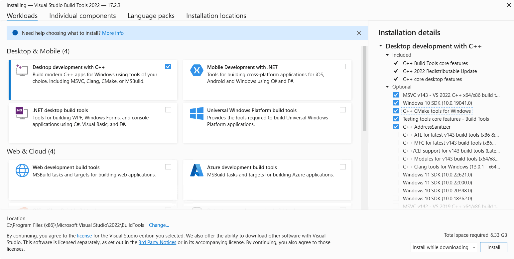

# TutorGPT


## Pre-installation

Make sure you have the following installed before starting:

- [Node.js](https://nodejs.org/)
- [Python](https://www.python.org/downloads/)

### Windows only — required before setup

You must install **Microsoft C++ Build Tools** once before running the setup:

1. Go to https://visualstudio.microsoft.com/visual-cpp-build-tools/
2. Download and run `vs_BuildTools.exe`
3. Tick **"Desktop development with C++"**





4. Click Install
5. **Restart your terminal** after installation finishes

You only need to do this once on your machine.

---

## Installation

Clone the repository:

```bash
git clone https://github.com/C05-Chan/TutorGPT.git
cd TutorGPT
```

Install all dependencies:

**Mac:**
```bash
npm run setup:mac
```

**Windows:**
```powershell
npm run setup:windows
```

This may take up to 5 minutes.


---

## Configuration
 
Inside the `backend` folder, create a new file called `API.env` and add the following:
 
```
GITHUB_API_TOKEN=your_github_api_token_here
GEMINI_API_KEY=your_gemini_api_key_here
```
 
Replace the values with your actual API keys.
 
---

## Running the App

**Mac:**
```bash
npm run start:mac
```

**Windows:**
```powershell
npm run start:windows
```

Then open your browser and go to: http://localhost:5173
